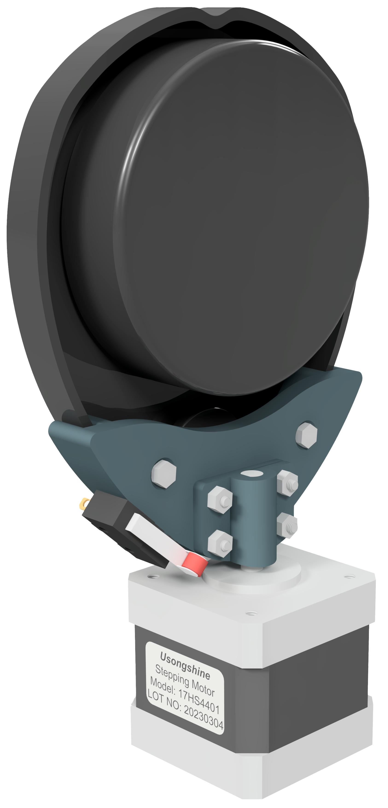

# 3D Parts of Master's Thesis
This repository contains 3D models and supplementary materials related to my master's thesis.

## Table of Contents
- [Introduction](#introduction)
- [3D Models](#3d-models)
- [How to Use](#how-to-use)
- [Citation](#citation)

## Introduction
My master's thesis, titled "Three-dimensional mapping of an unknown environment based on a 2D laser measurement" explores the development of a low-cost 3D mapping system capable of generating a point cloud of an indoor environment and performing path planning. The work presented in this repository supports the findings and experiments conducted during the research process.

## 3D Models
This repository contains a collection of 3D models, which consists of a mechanism that connects the LiDAR sensor to the stepper motor's shaft, ensuring stability and minimizing vibration during operation. The design ensures that the sensor remains aligned with the motor shaft, preventing any displacement in measurement when the stepper motor rotates.

Some third-party parts were used to assemble the system, such as the stepper motor and screws.

## How to Use
The parts in this repository have been custom-designed for the Neato XV-11 LiDAR and Nema 17 stepper motor. For this, [Autodesk Inventor Professional 2023](https://www.autodesk.com/products/inventor/overview) software was used with the student license.

Feel free to explore and incorporate these models into your research or projects. Don't forget to cite this repository if you use the 3D models in your work.

## Citation
If you use the 3D models or materials from this repository in your research or projects, please cite my master's thesis and this repository as follows:

- Master's Thesis: Ferreira, E. "Three-dimensional mapping of an unknown environment based on a 2D laser measurement" Instituto Politécnico de Bragança, 2023.
- Repository: https://github.com/edilsonsfc/Tese-Lidar-Structure
